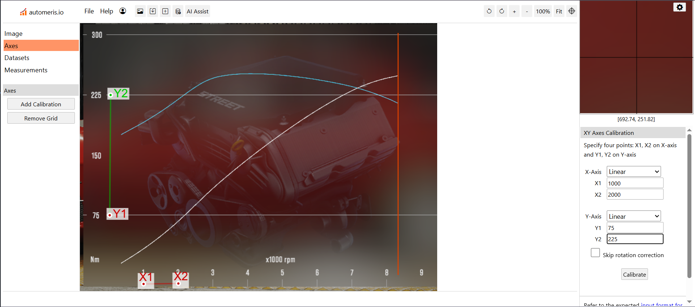
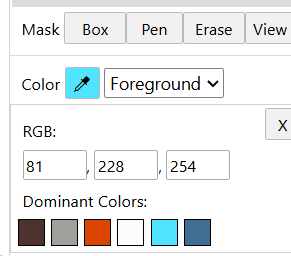
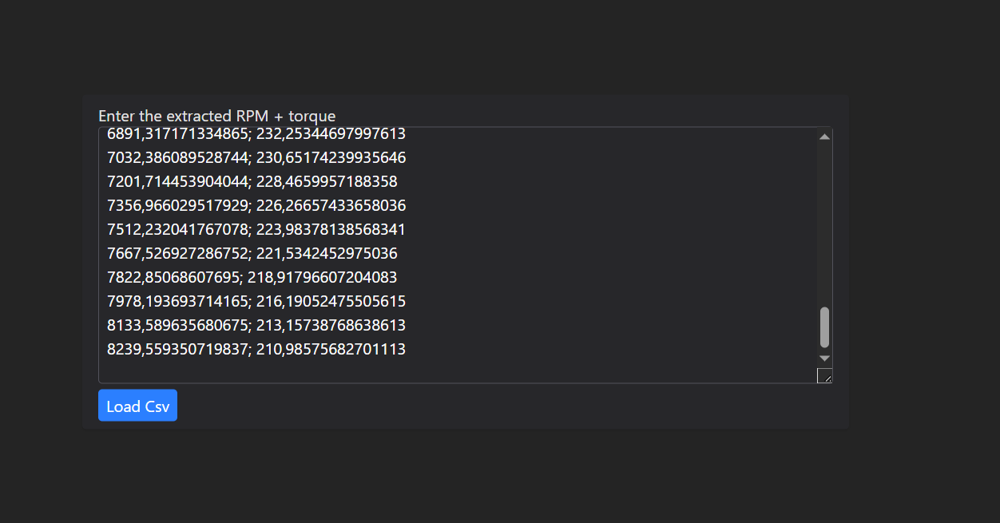

# Simple Gearbox Calculator

### ⚠️ Important Note: Early Development ⚠️
Please be aware that this project is currently in its early development stages. This means you might encounter bugs, incomplete features, or frequent updates. We appreciate your patience and feedback as we continue to improve it!

This tool helps you understand how a gearbox works by calculating its output speed and torque. It's based on the concepts explained in the video ["How to adjust gear ratios"](https://www.youtube.com/watch?v=8_SaobHPhWs) by [stepunique](https://coff.ee/stepunique).

# What is a Gearbox Calculator?

Imagine your car's engine. It produces a certain amount of power (speed and torque). A gearbox helps transfer this power to the wheels, often changing the speed and force (torque) to suit different driving conditions.

This calculator helps you figure out:

- Gear Ratio: This is a number that tells you how much the gearbox changes the speed and torque. A higher gear ratio means more force but less speed, and vice-versa.

- Output Speed (RPM): How fast the output shaft of the gearbox spins.

- Output Torque: How much rotational force the gearbox produces.

You will provide the initial speed and torque from your engine, and the calculator will show you the results after going through a specific gear ratio.

# How to Use the Tool

Visit the Project Page: Go to the GitHub page for this project. You can find it [here](https://yoyas24xd.github.io/simple-gearbox-calculator/).

Prepare Your Engine Data: You'll need to provide your engine's speed (RPM) and torque values. These values should be in a specific format called CSV (Comma Separated Values).

Paste the Data: When you open the project's web page, a window will pop up. Paste your RPM and torque values (in CSV format) into this window.

Once you paste the data, the calculator will start with some default settings. You can then adjust these settings to match your car's specific gear ratios, and the tool will display a graph showing the results at the bottom of the page.

# How to Get Engine Data from an Image

To get the exact numbers from such an image, you'll need a special tool.

Important Tip: The clearer the image of the graph, the more accurate your results will be. It's best to take a photo or screenshot of just the graph itself, without the rest of the screen.

We recommend using this online tool to extract the values from your image: [WebPlotDigitizer](https://automeris.io/).

Here's how to use it:

Upload Your Image: Go to the [WebPlotDigitizer](https://automeris.io/) website and upload your engine power graph image.

Select Graph Type: Choose "2D Plot (X-Y Plot)" and then select "Line plot" as the type of graph you want to extract.

Set Reference Points: The tool needs to know the scale of your graph. You'll select two points on the X-axis and two points on the Y-axis. After selecting each point, you'll enter the exact numerical value that corresponds to that point on your graph.

Select the Line Color: Next, you need to tell the tool which line on the graph you want to digitize. Click on the color picker tool. A section will appear showing the dominant colors in your image. One of these will be the color of the line you're interested in.

Run the Digitizer: Once you've selected the color, simply click the "Run" button. You'll see the tool automatically select points along the line you chose.

Get Your Data: If everything went well, click the "View Data" button. This will display a table of the extracted RPM and torque values. Copy these values.

Paste into the Calculator: Now, go back to the Simple Gearbox Calculator web page and paste these copied values into the pop-up window that appears when you start the web application.

That's it! You're ready to start calculating and visualizing your gearbox performance.
